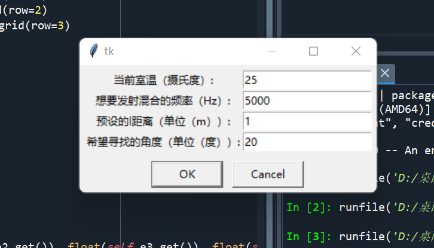
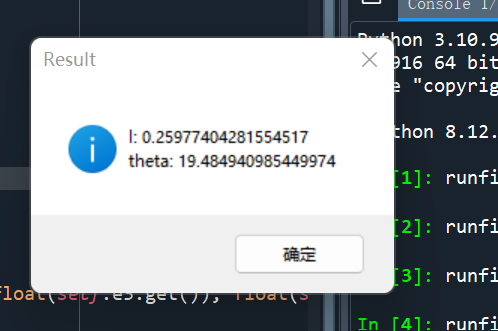

## Design-Experiment-on-the-Directionality-of-Sound-Wave-Radiation
实验内容为设计一个耳机扬声器阵列，在三方处于等边三角形三个顶点是，使敌军联络员只能收到特定频率的信号，而我军联络员只能收到不同的频率信号，双方互不干扰
## 实验原理
同相球源远场指向性问题，其中涉及的声学公式,指向性为0
$$lsin\theta=m'\frac{\lambda}{2}$$
其中l为可调节自定义参数，其意义为等边三角形边长，即三方距离
$\theta$为发生信号源相距离我方偏转角度，即可得与敌方情报员偏转角为
$60-\theta$,m'为任意奇数可取1,3,5,7...其中
$\lambda=\frac{V}{f}$,已知在不同温度下声速的表达式为
$$V=331.6+T*0.6$$
若要达到实验要求，需要满足
$$lsin\theta=m_1'\frac{\frac{V}{2000}}{2}$$
$$lsin(60-\theta)=m_2'\frac{\frac{V}{f}}{2}$$
其中f为我方约定的频率
在此代码中我们假定
$$m_1'=1，m_2'=3$$
在实际代码中，可在下面部分更改
```python
def equations(vars):
    l, theta = vars
    m1 = 1
    m2 = 3
    eq1 = l*np.sin(np.radians(theta)) - m1*V/2000/2
    eq2 = l*np.sin(np.radians(60)-theta) - m2*V/v/2
    return np.sqrt(eq1**2 + eq2**2)
```
直接运行声学update.py文件可以得到以下弹窗，输入需要的参数条件


按“OK”即可得到相关数据


## 升级代码
声学update.py，5月31日更新了窗口，使输入与输出在同一个界面，可以实现连续操作
